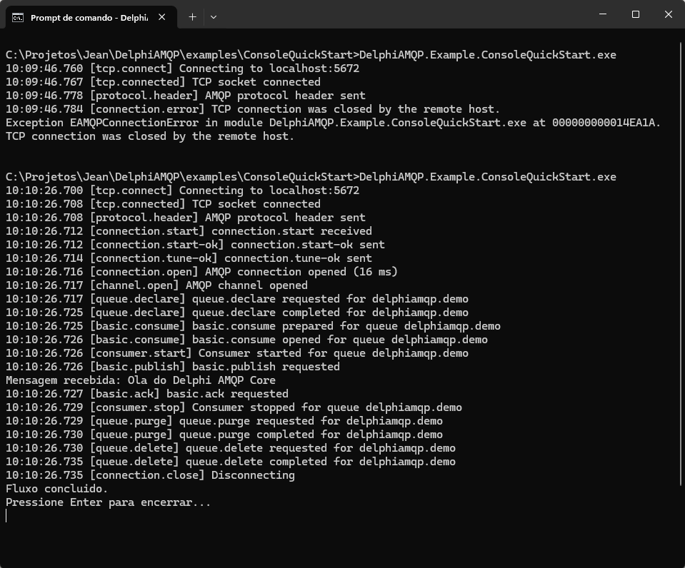
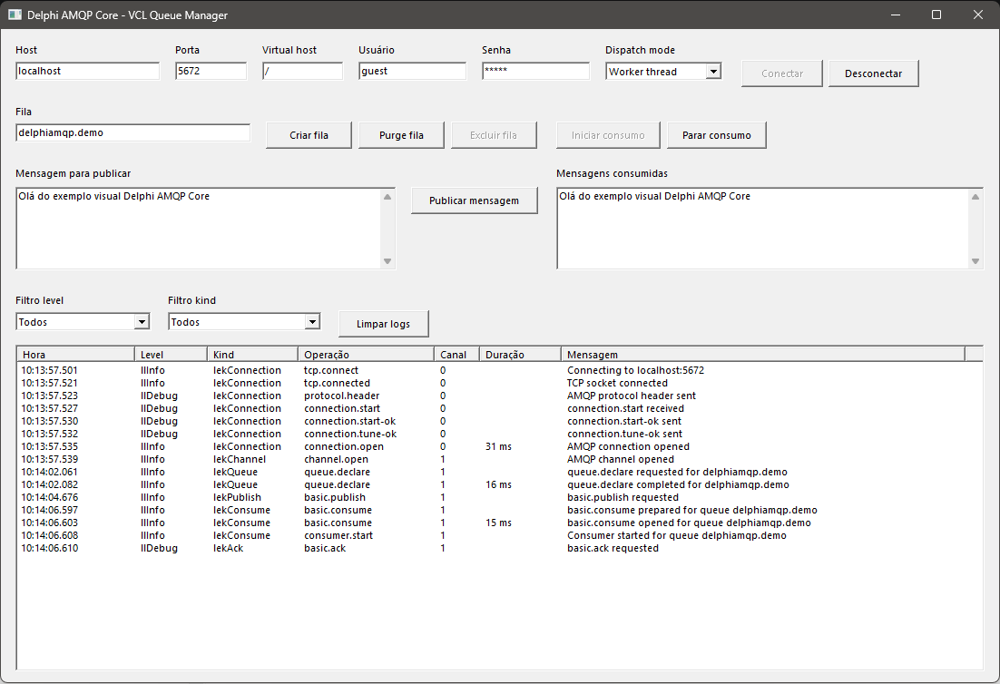

# Delphi AMQP Core

Delphi AMQP Core é uma biblioteca open source para comunicação nativa com
RabbitMQ e brokers compatíveis com AMQP 0-9-1.

O objetivo é permitir que uma aplicação Delphi consiga conectar, declarar filas,
publicar mensagens, consumir mensagens de forma assíncrona, executar `ack`,
`nack` e `reject`, limpar/excluir filas e observar operações por logs
estruturados sem depender de componentes Delphi externos.

## Índice

- [Recursos](#recursos)
- [Tecnologias](#tecnologias)
- [RabbitMQ local](#rabbitmq-local)
- [Como usar](#como-usar)
- [Consumo assíncrono](#consumo-assíncrono)
- [Observabilidade](#observabilidade)
- [Exemplos](#exemplos)
- [Testes](#testes)
- [Documentação técnica](#documentação-técnica)
- [Licença](#licença)

## Recursos

- Cliente AMQP 0-9-1 nativo para Delphi.
- Transporte TCP implementado com WinSock/RTL.
- Handshake AMQP 0-9-1 com autenticação `PLAIN`.
- Abertura e fechamento de conexão e canal.
- `queue.declare`, `queue.purge` e `queue.delete`.
- `basic.publish`.
- `basic.consume`, `basic.ack`, `basic.nack` e `basic.reject`.
- Consumo assíncrono em worker thread.
- API pública baseada em interfaces.
- Logger estruturado via `IAMQPLogger`.
- Testes de contrato, integração real com RabbitMQ e performance.

## Tecnologias

- Delphi 10.4+ Win64.
- Object Pascal.
- AMQP 0-9-1.
- RabbitMQ.
- TCP/WinSock.
- Interfaces Delphi com reference counting.
- Worker threads.
- Docker para ambiente RabbitMQ local.

## RabbitMQ local

Para executar os exemplos e os testes reais, instale o Docker Desktop para
Windows, deixe o Docker em execução e rode no PowerShell:

```powershell
docker run -d `
  --name delphi-amqp-rabbitmq `
  -p 5672:5672 `
  -p 15672:15672 `
  rabbitmq:3-management
```

Credenciais padrão:

- Host: `localhost`
- Porta AMQP: `5672`
- Virtual host: `/`
- Usuário: `guest`
- Senha: `guest`
- RabbitMQ Management: `http://localhost:15672`

## Como usar

Adicione a pasta `src` ao search path do projeto Delphi ou inclua as units do
componente diretamente no projeto.

Exemplo básico de conexão, criação de fila e publicação:

```pascal
var
  Factory: IAMQPConnectionFactory;
  Options: IAMQPConnectionOptions;
  Connection: IAMQPConnection;
  Channel: IAMQPChannel;
begin
  Factory := TAMQPConnectionFactory.Create;

  Options := TAMQPConnectionOptions.CreateDefault
    .SetHost('localhost')
    .SetPort(5672)
    .SetVirtualHost('/')
    .SetUserName('guest')
    .SetPassword('guest');

  Connection := Factory.CreateConnection(Options);
  Connection.Connect;

  Channel := Connection.CreateChannel;
  Channel.QueueDeclare('delphiamqp.demo', True, False, False);
  Channel.Publish('', 'delphiamqp.demo', TAMQPMessage.FromText('Olá AMQP'));

  Channel.QueuePurge('delphiamqp.demo');
  Channel.QueueDelete('delphiamqp.demo');
  Connection.Disconnect;
end;
```

Os parâmetros principais de `QueueDeclare` são:

- nome da fila;
- durable;
- exclusive;
- auto-delete.

Em `Publish`, quando o exchange é vazio (`''`), o RabbitMQ usa o exchange
padrão e a routing key deve ser o nome da fila.

## Consumo assíncrono

O consumo é feito por `IAMQPConsumer`. O callback pode confirmar a mensagem com
`Ack`, reenfileirar com `Nack(True)`, descartar com `Nack(False)` ou rejeitar com
`Reject`.

```pascal
Consumer := Channel.BasicConsume(
  'delphiamqp.demo',
  procedure(const AMessage: IAMQPMessage; const AContext: IAMQPConsumerContext)
  begin
    try
      Writeln(AMessage.AsText);
      AContext.Ack;
    except
      AContext.Nack(True);
    end;
  end,
  False);

Consumer.Start;
```

Use `AAutoAck=False` quando quiser confirmar manualmente. Com `AAutoAck=True`,
o broker considera a mensagem confirmada no momento da entrega.

## Observabilidade

Passe um `IAMQPLogger` para `TAMQPConnectionFactory.Create` para receber eventos
estruturados de conexão, canal, fila, publish, consume, ack/nack/reject,
heartbeat e erro.

```pascal
Factory := TAMQPConnectionFactory.Create(TConsoleLogger.Create);
```

Cada evento contém dados como:

- `Timestamp`;
- `Level`;
- `Kind`;
- `Operation`;
- `ConnectionId`;
- `ChannelId`;
- `ErrorClass`;
- `DurationMS`.

Sem logger explícito, a biblioteca usa um logger nulo interno.

## Exemplos

O repositório mantém dois exemplos.

### ConsoleQuickStart

Ele demonstra, em um fluxo linear no `begin/end`:

- configurar conexão;
- conectar no RabbitMQ;
- abrir canal;
- declarar fila;
- iniciar consumer assíncrono;
- publicar mensagem;
- receber mensagem;
- confirmar com `Ack`;
- executar `purge`;
- excluir fila;
- desconectar.

Execução:

```powershell
cd examples\ConsoleQuickStart
dcc64 -B DelphiAMQP.Example.ConsoleQuickStart.dpr
.\DelphiAMQP.Example.ConsoleQuickStart.exe
```



### VclQueueManager

Exemplo visual VCL com `MainForm.pas` e `MainForm.dfm`.

O exemplo usa o modelo tradicional VCL e mantém uma única conexão e um único
canal compartilhados entre os botões. Cada botão deixa o código AMQP direto no
próprio handler de evento, de forma intencionalmente didática.

Ele demonstra:

- configurar host, porta, virtual host, usuário, senha e dispatch mode;
- conectar e desconectar;
- criar fila;
- executar `purge`;
- excluir fila;
- publicar mensagem;
- iniciar e parar consumo;
- visualizar mensagens consumidas;
- visualizar logs estruturados;
- filtrar logs por `Level` e `Kind`.

Execução:

```powershell
cd examples\VclQueueManager
dcc64 -B DelphiAMQP.Example.VclQueueManager.dpr
```

Também é possível abrir `DelphiAMQP.Example.VclQueueManager.dproj` no Delphi
10.4+ Win64.



## Testes

O projeto possui três grupos de testes.

### ConsoleContracts

Testes de contrato sem RabbitMQ real. Devem rodar em todo commit/pull request.

O projeto usa runner console puro, sem framework externo de teste. O `.dpr`
principal apenas chama as suítes, que ficam separadas por responsabilidade em
`tests/ConsoleContracts/Cases/`.

Validam:

- defaults e validações de configuração;
- mensagens texto/binário;
- cópia defensiva do body;
- metadata de mensagens recebidas;
- encode/decode de frames AMQP;
- erros básicos do codec de frames;
- builders e readers de métodos AMQP;
- parse de `connection.start` e validação de mecanismos SASL/locales;
- parse de `connection.close` e `channel.close`;
- exceções tipadas de protocolo;
- logger em memória;
- operações de canal com sessão fake;
- fechamento de canal com `channel.close`/`channel.close-ok`;
- emissão de eventos com duração em operações bloqueantes de canal;
- consumer, contexto de `Ack/Nack/Reject`, start/stop e auto-ack.

Execução:

```powershell
cd tests\ConsoleContracts
dcc64 -B DelphiAMQP.Tests.Console.dpr
.\DelphiAMQP.Tests.Console.exe
```

### IntegrationRabbitMQ

Testes reais contra RabbitMQ. Devem ficar em job separado, porque dependem de
broker disponível.

Validam:

- conexão real;
- abertura de canal;
- declaração de fila;
- publicação;
- consumo assíncrono com `Ack`;
- `purge`;
- `delete`;
- desconexão.

Variáveis de ambiente opcionais:

```text
AMQP_TEST_HOST=localhost
AMQP_TEST_PORT=5672
AMQP_TEST_VHOST=/
AMQP_TEST_USER=guest
AMQP_TEST_PASSWORD=guest
```

Execução:

```powershell
cd tests\IntegrationRabbitMQ
dcc64 -B DelphiAMQP.Tests.IntegrationRabbitMQ.dpr
.\DelphiAMQP.Tests.IntegrationRabbitMQ.exe
```

### PerformanceRabbitMQ

Teste manual de performance contra RabbitMQ real. Ele simula múltiplas
conexões, consumers e publishers, publica payloads JSON, valida IDs únicos e
gera relatório com tempo total, throughput, mensagens faltantes, duplicadas e
erros.

O teste usa uma conexão por publisher e uma conexão por consumer para evitar
leitura concorrente de frames no mesmo socket AMQP. A fila é limpa no início,
mas permanece criada ao final para permitir inspeção no RabbitMQ Management.

Perfis:

```text
L ou LEVE   : 5 conexões, 5 consumers, 1 publisher, 1.000 mensagens
M ou MEDIO  : 20 conexões, 50 consumers, 2 publishers, 10.000 mensagens
P ou PESADO : 100 conexões, 200 consumers, 5 publishers, 100.000 mensagens
```

Execução:

```powershell
cd tests\PerformanceRabbitMQ
$env:AMQP_PERF_PROFILE='L'
dcc64 -B DelphiAMQP.Tests.PerformanceRabbitMQ.dpr
.\DelphiAMQP.Tests.PerformanceRabbitMQ.exe
```

Variáveis de ambiente opcionais:

```text
AMQP_TEST_HOST=localhost
AMQP_TEST_PORT=5672
AMQP_TEST_VHOST=/
AMQP_TEST_USER=guest
AMQP_TEST_PASSWORD=guest
AMQP_PERF_PROFILE=L
AMQP_PERF_QUEUE=delphiamqp.performance.test
```

Exemplo de payload publicado:

```json
{
  "id": 1,
  "identificador": "delphi-amqp-core-perf",
  "tipo": "tipo-1",
  "mensagem": "Mensagem curta para teste de performance."
}
```

## Documentação técnica

- [`docs/architecture.md`](docs/architecture.md): arquitetura pública e divisão
  de responsabilidades.
- [`docs/technical-guide.md`](docs/technical-guide.md): detalhes internos de
  transporte TCP, codec AMQP, handshake, canais, filas, consumo e logs.

## Licença

MIT. Veja [`LICENSE`](LICENSE).

Copyright (c) 2026 Delphi AMQP Core contributors.

Contribuições pertencem aos seus respectivos autores, salvo indicação diferente
na própria contribuição.
